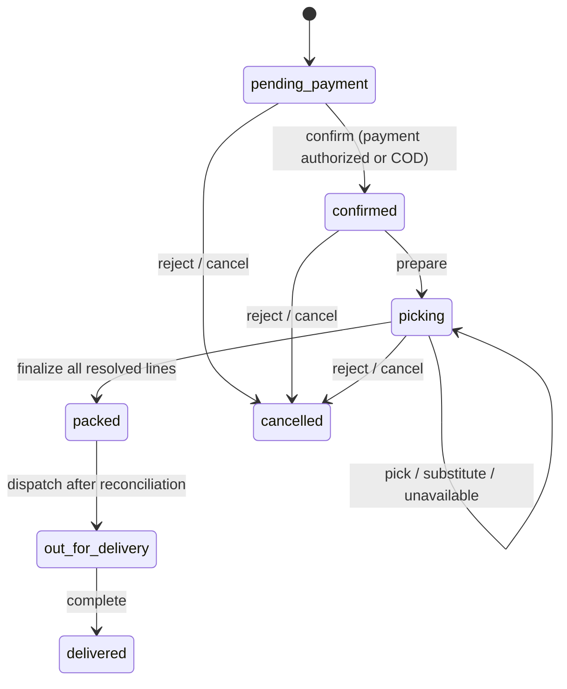

# Release 2: Fulfilment and Reconciliation Implementation

**Project:** Grocerly / mini-ecommerce API  
**Release:** 2 — line-level fulfilment, final pricing, inventory consumption, and reconciliation  
**Status:** Implemented and verified  
**Author:** Manus AI  

## Purpose and delivery scope

Release 2 closes the operational gap between a payment-authorized grocery order and a safely dispatched order. Grocery baskets cannot be finalized at checkout when actual weights, out-of-stock lines, and approved substitutions are unknown. This release gives administrators explicit, auditable commands to resolve each order line, calculate the authoritative final basket, consume stock exactly once, and resolve any difference between the initial Bakong payment amount and the final total.

> **Financial boundary:** the application never fabricates a payment-provider capture, refund, or collection. When a Bakong order’s final amount differs from the verified estimated payment, an administrator records the completed external adjustment using an auditable reference before the order can be dispatched.

| Capability | Delivered behavior | Primary risk mitigated |
|---|---|---|
| Explicit line picking | Records actual quantity and scale weight with server-side price calculation. | Staff cannot submit arbitrary line totals. |
| Controlled substitutions | Enforces the customer preference, selling shape, active product state, and audit snapshot. | Unauthorized or incompatible replacements cannot silently change a basket. |
| Unavailable lines | Resolves a line with no charge and releases its reservation on finalization. | Customers are not charged and stock is not retained for unavailable goods. |
| Atomic finalization | Locks rows, consumes actual inventory, releases unused reservations, writes ledger records, and packs the order in one transaction. | Double consumption, overselling, and partial finalization are prevented. |
| Reconciliation gate | Produces deterministic `settled`, `amount_due`, `refund_due`, or `not_required` status. | A staff member cannot dispatch a financially unresolved order. |
| Audit trail | Stores fulfilment events and status history with the acting administrator. | Operational changes remain attributable and reviewable. |

## Implemented lifecycle

The final workflow is intentionally command-oriented. Staff cannot supply a generic mutable status or write final prices directly.



| Stage | Required invariant | Result |
|---|---|---|
| `picking` | Every line is initially `pending`; stock remains reserved from checkout. | Staff may pick, substitute, or mark individual lines unavailable. |
| `finalize` | Every line must be resolved. | Actual stock is consumed once, unused original reservations are released, final totals are written, and the order becomes `packed`. |
| `packed` | Inventory has a durable `fulfilledAt` marker. | The final payment delta is known and stored. |
| `dispatch` | Final totals and inventory fulfilment exist; non-COD reconciliation is settled. | The order may advance to `out_for_delivery`. |

## API command reference

All commands below require an authenticated admin and the existing `authenticated` throttle.

| Endpoint | Command | Core validation and result |
|---|---|---|
| `POST /v1/admin/orders/{orderId}/items/{itemId}/pick` | Resolve a line with actual quantity/weight. | Quantity must be positive and not exceed the ordered quantity. Weight is mandatory only for weight-sold products. |
| `POST /v1/admin/orders/{orderId}/items/{itemId}/substitutions` | Resolve a line with a replacement product. | Product must be active and sold in the same shape. `none` rejects; `contact_me` requires explicit customer approval. |
| `POST /v1/admin/orders/{orderId}/items/{itemId}/unavailable` | Resolve a line with no selected item. | A reason is required; the final line amount remains null. |
| `POST /v1/admin/orders/{orderId}/finalize` | Complete picking and calculate final totals. | All lines must be resolved. Executes inventory and order-state changes atomically. |
| `POST /v1/admin/orders/{orderId}/reconcile` | Record external collection/refund completion. | Available only for `amount_due` or `refund_due` packed orders; requires a reference. |
| `POST /v1/admin/orders/{orderId}/advance` | Move coarse order state. | `dispatch` (and legacy `deliver`) only works from a financially reconciled `packed` order. |

The detailed HTTP request/response shapes and RFC 9457 problem types are defined in [`API.md`](API.md) and [`openapi.yaml`](openapi.yaml).

## Accounting and inventory controls

Finalization applies the following rules under one database transaction.

| Scenario | On-hand inventory | Reserved inventory | Ledger records | Final line amount |
|---|---:|---:|---|---:|
| Picked as ordered | Decreased by actual pick | Original reservation removed | `order_fulfilled` | Snapshot unit price × actual selected quantity/weight |
| Picked below ordered amount | Decreased by actual pick | Full original reservation removed | `order_fulfilled` and `order_released` for unused reserved quantity | Snapshot unit price × actual selected quantity/weight |
| Picked above a weight estimate | Decreased by actual weight | Original reservation removed | `order_fulfilled`; the surplus must be available outside other reservations | Snapshot unit price × actual scale weight |
| Substitute selected | Substitute on-hand is decreased; original is unchanged | Original reservation removed | `order_fulfilled` for substitute and `order_released` for original | Substitute snapshot price × selected quantity/weight |
| Unavailable | Unchanged | Original reservation removed | `order_released` | No final line amount; zero contribution to final subtotal |

The final order calculation deliberately uses **only** `order_items.final_line_total`. A substitution’s `price_delta` is retained as an audit/display explanation and is never added a second time. The calculation remains:

```text
subtotal_final = sum(final_line_total, treating unavailable lines as 0)
total_final    = subtotal_final + delivery_fee + tax_final - discount_total
reconciliation_delta = total_final - authorized_or_paid_amount
```

The system stores separate durable markers for fulfilled inventory and released reservations. Clearing `reservation_expires_at` no longer implies a release because a verified Bakong payment also clears the payment deadline.

## Reconciliation policy

| Condition | Stored status | Dispatch policy | Required operational action |
|---|---|---|---|
| COD order | `not_required` | Allowed after finalization. | Collect according to the delivery process. |
| Final equals authorized/paid amount | `settled` | Allowed after finalization. | No payment adjustment is needed. |
| Final exceeds authorized/paid amount | `amount_due` | Blocked. | Complete the additional approved collection externally, then record the reference. |
| Final is below authorized/paid amount | `refund_due` | Blocked. | Complete the refund/adjustment externally, then record the reference. |
| Reconciliation recorded | `settled` | Allowed. | The administrator reference and timestamp form the audit record. |

## Deployment procedure

Deploy the application code first, then apply database changes in the same maintenance window.

```bash
php artisan migrate --force
php artisan optimize
```

After migration, verify the new admin endpoints appear in the route table:

```bash
php artisan route:list --path=admin/orders
```

Operations staff should be trained to use the commands in the following order: `prepare`, resolve every line, `finalize`, inspect the returned `reconciliation` object, record any required external adjustment using `reconcile`, then `dispatch`. Staff should not treat `deliver` as an immediate picking-to-delivery shortcut; it remains only as a legacy alias for the now packed-only dispatch action.

## Verification record

The implementation was validated using the full automated suite, route compilation, migration application, code formatting checks, and production cache compilation.

| Validation | Result |
|---|---|
| Full automated test suite | **322 tests, 1,187 assertions passing** |
| New Release 2 workflow suite | 5 tests covering authorization, picking, substitution, unavailable-line release, finalization, reconciliation, exact-once inventory consumption, and dispatch blocking |
| Database migration | Applied successfully in the local environment |
| Formatting | Project formatter passes |
| Production cache compilation | Configuration, route, and view caches compile successfully |

## Remaining operational considerations

The Release 2 reconciliation endpoint records an externally completed adjustment because the current Bakong integration safely verifies a payment but does not expose a configured merchant-side refund or supplemental-charge operation. If an approved Bakong merchant API capability for those actions becomes available, add a provider adapter behind the existing reconciliation state machine rather than bypassing the status, audit, and dispatch gates.

The current checkout tax is zero. The finalization code keeps `tax_final` explicit and calculates it deterministically, so a future tax-rate snapshot can be added without changing the final-line-total or reconciliation invariants.

The fulfilment-event table is intentionally append-only in normal application use. Retain it together with inventory adjustments and order status history according to the organization’s accounting and customer-service retention policy.
